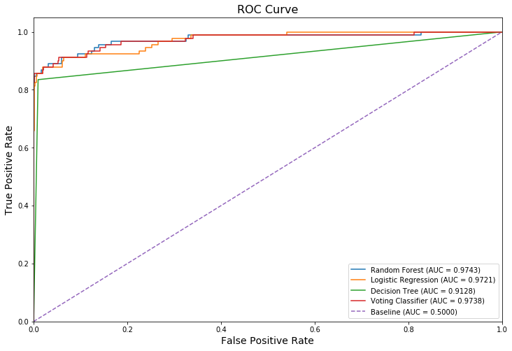

# Fraud Detection
<br>
This repo contains the Fraud Detection project as part of my data science portfolio. The objective is to detect fraudulent cases using a dataset of credit card transactions. 

1. [Problem Statement](#problem)
2. [Dataset](#data)
3. [Exploratory Data Analysis](#eda)
4. [Traditional Method](#trad)
5. [Machine Learning](#ml)
6. [Discussion and Conclusion](#conclusion)

# <a name="problem">Problem Statement</a>
Organizations around the world lose an estimated five percent of their annual revenues to fraud, according to a survey of Certified Fraud Examiners (CFEs) who investigated cases between January 2010 and December 2011. Applied to the estimated 2011 Gross World Product, this figure translates to a potential total fraud loss of more than $3.5 trillion. ([Source](https://www.acfe.com/press-release.aspx?id=4294973129)). In this project, we will explore how to fight fraud by using data. We will apply machine learning algorithms to detect fraudulent behavior similar to past ones. In fraud analytics we often deal with highly imbalanced datasets when classifying fraud versus non-fraud, and in this project we will examine some techniques on how to deal with that. For example, we will make use of ```imbalanced-learn```, a Python module to balance data set using under- and over-sampling. More info [here](https://anaconda.org/conda-forge/imbalanced-learn).
To install this package with conda run the following:<br>
``conda install -c conda-forge imbalanced-learn``

# <a name="data">Dataset</a>

The dataset used in this project is downloaded from DataCamp's [Fraud Detection in Python course](https://www.datacamp.com/courses/fraud-detection-in-python). It is a dataset containing credit card transactions data. Fraud occurrences are fortunately an extreme minority in these transactions. However, Machine Learning algorithms usually work best when the different classes contained in the dataset are more or less equally present. If there are few cases of fraud, then there's little data to learn how to identify them. This is known as **class imbalance**, and it's one of the main challenges of fraud detection. Let's explore this dataset, and observe this class imbalance problem.

***
# <a name="conclusion">Discussion and Conclusion</a>
By combining the classifiers, we can take the best of multiple models. Random Forest as a standalone model was good in Precision but quite bad in terms of false negatives. Logistic Regression was good in Recall but very bad in terms of false positives. Decision Tree was in the middle. By combining these models together we indeed managed to improve performance. We have increased the cases of fraud that we are catching from 75 to 78, and reduced false negatives by 3, and we only have 4 extra false positives in return. If we do care about catching as many fraud cases as we can, whilst keeping the false positives low, this is a pretty good trade-off. 


| Model | Precision | Recall | f1-score | Accuracy | AUC ROC | TP | FP | FN | TN |
|---|---|---|---|---|
| Random Forest | 0.99 | 0.82 | 0.90 | 0.9922 | 0.9743 | 75 | 1 | 16 | 2098 |
| Logistic Regression | 0.65 | 0.88 | 0.74 | 0.9749 | 0.9721 | 80 | 44 | 11 | 2055 |
| Decision Tree | 0.79 | 0.84 | 0.81 | 0.9840 | 0.9128 | 76 | 20 | 15 | 2079 |
| Voting Classifier | 0.94 | 0.86 | 0.90 | 0.9918 | 0.9738 | 78 | 5 | 13 | 2094 |

<br><br>
If you have any feedback for this project, feel free to contact me via my [LinkedIn](https://www.linkedin.com/in/limchiahooi) or [GitHub Pages](https://limchiahooi.github.io).

---

